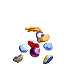

<picture>
  <source media="(prefers-color-scheme: dark)" srcset="https://github.com/rafshawn/rafshawn/blob/output/github-contribution-grid-snake.svg" />
  <source media="(prefers-color-scheme: light)" srcset="https://github.com/rafshawn/rafshawn/blob/output/github-contribution-grid-snake.svg" />
  
</picture>

_Generated with [Platane/snk](https://github.com/Platane/snk)_